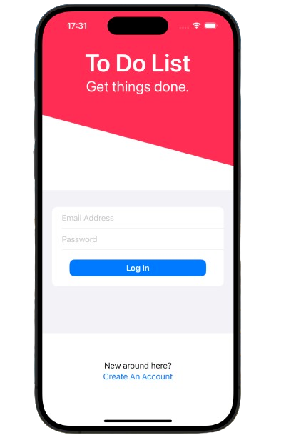
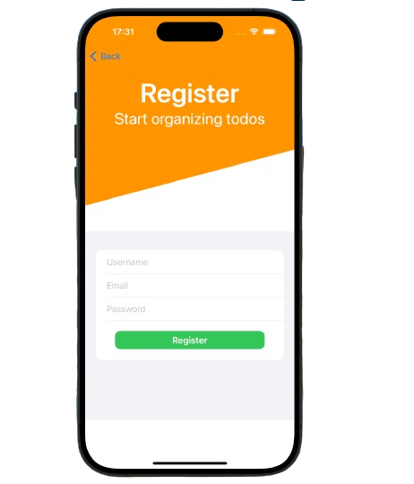
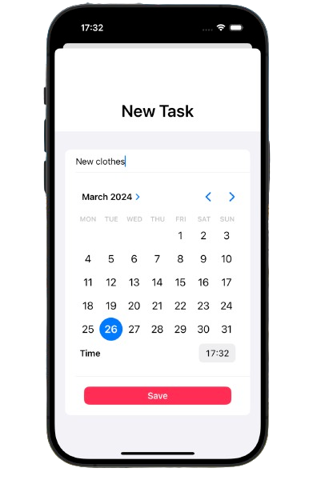
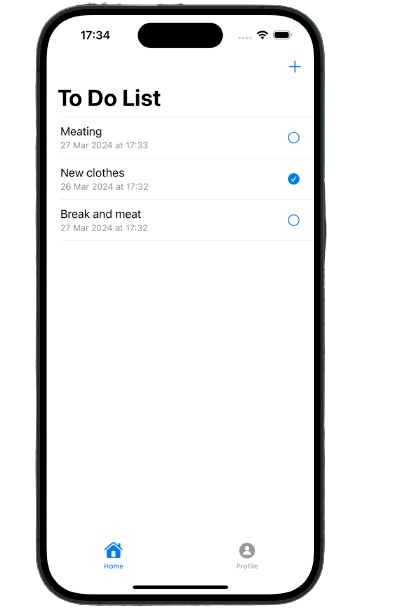

# ToDoListApp

Full featured universal (iOS, iPadOS) app.

    
    
    
    

## Overview
- Written in Swift
- Uses SwiftUI
- Designed with MVVM pattern
- Auto layout Based
- Built in Xcode 15

## Design

The app has four area:

1. Login View
2. Register View
3. Item List View
4. Profile View
